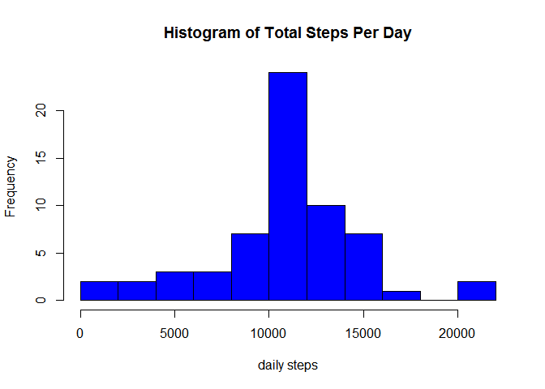

# Reproducible Research: Peer Assessment 1


## Loading and preprocessing the data

The libraries necessary for the assignment were loaded and the date was read into a data table. The code presented assumes that the 
data is unzipped in the working directory. Data for this assignment was 
downloaded 10-Jan-2016 9pm AST from the [link]((https://d396qusza40orc.cloudfront.net/repdata%2Fdata%2Factivity.zip)) provided.


```r
library (dplyr); library (lattice); library (lubridate)
```

```
## 
## Attaching package: 'dplyr'
## 
## The following objects are masked from 'package:stats':
## 
##     filter, lag
## 
## The following objects are masked from 'package:base':
## 
##     intersect, setdiff, setequal, union
```

```r
ActivityData<-read.csv("activity.csv")
str(ActivityData)
```

```
## 'data.frame':	17568 obs. of  3 variables:
##  $ steps   : int  NA NA NA NA NA NA NA NA NA NA ...
##  $ date    : Factor w/ 61 levels "2012-10-01","2012-10-02",..: 1 1 1 1 1 1 1 1 1 1 ...
##  $ interval: int  0 5 10 15 20 25 30 35 40 45 ...
```


## What is mean total number of steps taken per day?

1. The total number of steps per data is calculated.

```r
DailyTotal<-group_by(ActivityData,date)%>%summarise(sum(steps))
DailyTotal<-rename(DailyTotal, totalsteps =`sum(steps)`)
```

2. The results are shown in a histogram. 


```r
hist(DailyTotal$totalsteps, col = "blue", breaks=10,
     main="Histogram of Total Steps Per Day",
     xlab= "daily steps")
```

 

3. The mean and median steps per day are calculate and stored as a variable for later use.These variables are imbeded in the text below to show the results of the calcualtions.


```r
daymean<-mean(DailyTotal$totalsteps, na.rm=TRUE)
daymedian<-median(DailyTotal$totalsteps, na.rm=TRUE)
```

From this, it is calculated that the **mean number of steps per day is 10766.2** and the **median number of steps per day is 10765**.    


## What is the average daily activity pattern?

1. Using the dplyr package, the data is grouped by interval and the average number of steps for each interval is calculated. A plot is then constrcuted showng the average number of steps per interval.


```r
IntervalTotal<-ActivityData %>% group_by(interval)%>% summarise(avgsteps=mean(steps, na.rm=TRUE))

plot(IntervalTotal$interval, IntervalTotal$avgsteps, 
     type="l", main="Mean number of steps per 5 min interval",
     xlab="time interval", ylab="number of steps")
```

 

2. For the second part of this question, the interval with the highest average number of steps is calculated and the result is imbeded in the text below it.


```r
MaxInt<-IntervalTotal$interval[which.max(IntervalTotal$avgsteps)]
```

The 5-minute interval **835** has the maximum number of steps, on average, across all days.


## Imputing missing values
1. The total number of missing values is calculated and output.


```r
sum(is.na(ActivityData$steps))
```

```
## [1] 2304
```

2-4. Each missing value is estimated using the average number of steps for that interval. The results were stored in a new data frame.


```r
MergeData <- merge(ActivityData, IntervalTotal, by = "interval")
MergeData$steps[is.na(MergeData$steps)] <- MergeData$avgsteps[is.na(MergeData$steps)]
```

4. A histogram is created the new mean and median steps per day were calculated.


```r
NewDaily<-group_by(MergeData,date)%>%summarise(steps=sum(steps))
hist(NewDaily$steps, col = "blue", breaks=10,
     main="Histogram of Total Steps Per Day",
     xlab= "daily steps")
```

 

```r
newmean<-mean(NewDaily$steps, na.rm=TRUE)
newmean
```

```
## [1] 10766.19
```

```r
newmedian<-median(NewDaily$steps, na.rm=TRUE)
newmedian
```

```
## [1] 10766.19
```

```r
meandifference<-daymean-newmean
mediandifference<-daymedian-newmedian
```

With the missing values added, the mean steps per day is **10766.2** and the median steps per day is **10766.2**. 

The there is no difference in values of the original mean with the NA values removed **(10766.2)** and the new mean calculated after the NA values have been estimated with the daily averages **(10766.2)**. 

There is a small difference **(-1.1886792)**between the value of the original median **(10765)** and the new median calculated after the NA values have been estimated **(10766.2)**

## Are there differences in activity patterns between weekdays and weekends?

1. A new factor variable was created to indicate whether the data was collected on a weekday or weekend. First the days of the week were calculatd using the weekdays() function and then these were converted to indicate weekdays/weekends.


```r
MergeData$date<-ymd(MergeData$date)
MergeData<-mutate(MergeData, days=weekdays(date))
MergeData$days[MergeData$days =="Saturday"|MergeData$days=="Sunday" ]<-"weekend"
MergeData$days[MergeData$days !="weekend" ]<-"weekday"
IntervalAvg<-MergeData %>% group_by(interval, days) %>% summarise(avgperinterval=mean(steps))
```

2. A panel plot was created showing the number of steps for intervals on both weekdays and weekends using the lattice package

```r
xyplot(avgperinterval~interval|days, data=IntervalAvg, type="l",layout=c(1,2), 
       ylab="Average steps", main="Average steps per interval on weekend and weekdays")
```

 


